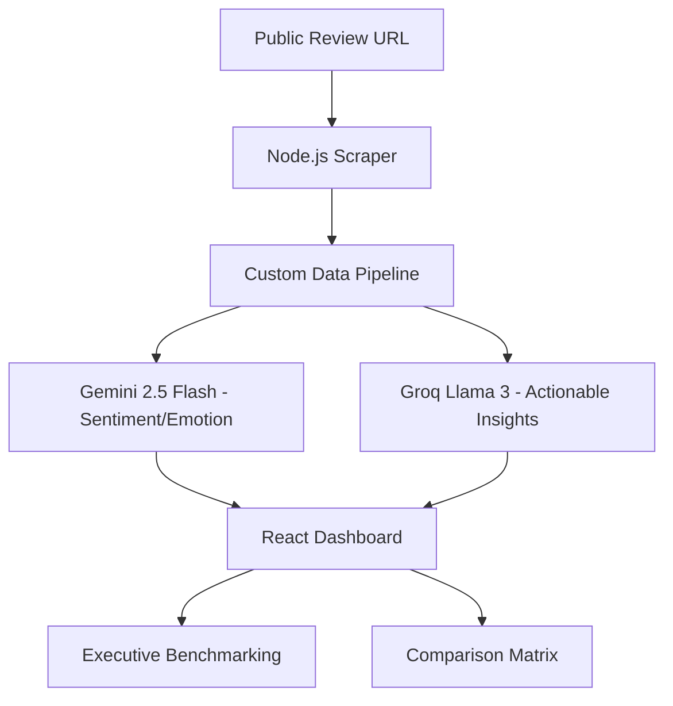

# 🧠 ReviewMind Intelligence Platform

<p align="center">
  
  
  
</p>

---

**ReviewMind** is a next-generation AI-powered analytics dashboard designed to transform raw product reviews into actionable business intelligence. Developed by **Team Mach 3**, the platform leverages advanced Multi-Model AI to perform high-fidelity sentiment analysis, emotion detection, and competitive benchmarking.

> [!TIP]
> **View Our Gallery**: Check out the high-resolution screenshots and demos here:
> [👉 Mach 3 Sample Photos & Assets](https://drive.google.com/drive/folders/1_wkbScvb0RPbePmuDcy5gUKo_BbvZvLK?usp=drive_link)

---

## ✨ Key Features

### 📊 Executive Benchmarking
Compare up to 3 products side-by-side with our high-fidelity scoring engine.
- **Overall Health Score**: Impact-weighted metric calculating category-specific performance.
- **Authenticity Audit**: AI-driven detection to identify suspected bot reviews and spam patterns.
- **Sentiment Variance**: Visual trace of emotional shifts (Joy, Anger, Disgust, etc.) over time.

### 🧩 Comparative Category Matrix
A revolutionary column-based matrix that breaks down specific pain points:
- **Product Quality**: Build integrity and defect tracking.
- **Delivery Experience**: Logistics partner SLA monitoring.
- **Packaging Integrity**: Safe arrival and material quality metrics.

### 🤖 Actionable AI Suite
- **AI Suggestion Engine**: Automatically generates professional, context-aware responses to customer feedback.
- **Priority Ticket System**: Detects urgent P1 issues and creates actionable items for your product team.

---

## 🛠️ The Tech Stack

| Layer | Technologies |
| :--- | :--- |
| **Frontend** | React 18, Vite, Framer Motion, Tailwind CSS, Recharts |
| **Backend** | Node.js, Express, Puppeteer (High-performance scraper) |
| **Artificial Intelligence** | Google Gemini 2.5 Flash, Groq (Llama 3), Hugging Face |
| **Infrastructure** | Vercel (Frontend), Render (Backend) |

---

## 🏗️ System Architecture



---

## 🚀 Getting Started

### 1. Prerequisites
- Node.js (v18+)
- API Keys for Google Gemini, Groq, and Hugging Face.

### 2. Environment Setup
Create a `.env` file in both `backend` and `review-mind` folders using the provided `.env.example` templates.

### 3. Installation
```bash
# Install root dependencies
npm install

# Run Backend
cd backend
npm install
node server.js

# Run Frontend
cd review-mind
npm install
npm run dev
```

---

## 🤝 Developed by Team Mach 3
*Finalist Submission for Hackathon 2026*

**Project Root**: `C:\Users\Basavaraj VG\Desktop\review_mind`
**Repository**: [manthaaaaan/hackmalendadufinal](https://github.com/manthaaaaan/hackmalendadufinal)
